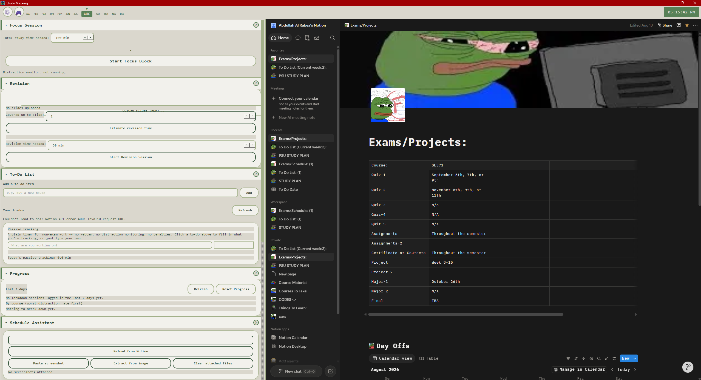
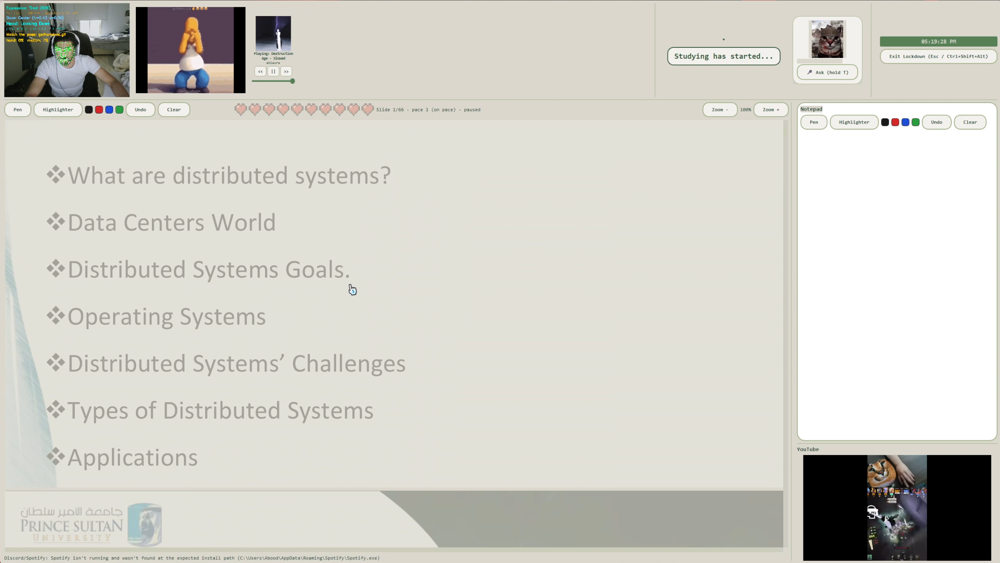
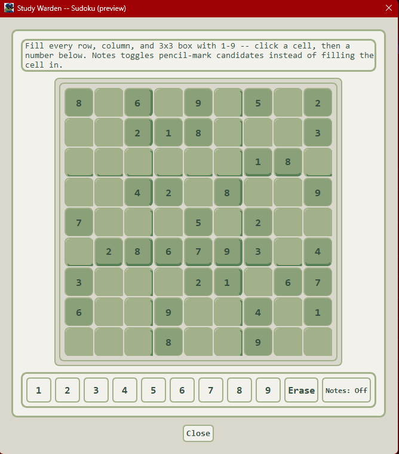

# Study Maxxing


A desktop study-accountability app for Windows: webcam-monitored focus
sessions, an AI study planner and voice assistant running entirely on a
local LLM, deep Notion integration, and a small library of break-time
mini-games — built around one real workflow, shared here for anyone
curious enough to try it or adapt it.

## What this actually is

I built this to automate adding exam and project dates to Notion.
It also helps determine how much time I should spend studying for each course, making sure I have enough time to prepare without cramming everything at the last minute.
There is also a **Lockdown Mode** that automatically minimizes any open windows and only displays the slides for the course I'm studying;
It is further reinforced by webcam monitoring to help keep me focused and prevent distractions.



## Features

**The AI features run entirely on a local LLM** via [LM
Studio](https://lmstudio.ai/) (an OpenAI-compatible local server) — no
cloud API key is ever used, nothing you type or upload leaves your
machine for the AI features specifically. This also means **AI response
speed is entirely dependent on which model you have loaded and your own
PC's specs** — a small model on a decent GPU can answer in a couple of
seconds; a larger or reasoning-heavy model on a modest CPU can take
significantly longer. This app doesn't (and can't) control that — it's
a property of whatever you point LM Studio at.

### 🔒 Monitor Lockdown — the core focus session
- **Full-screen enforced study view** — once the webcam/AI models finish
  loading, today's study material fills the screen with a live webcam
  feed and the timer docked in the header.
- **Soft-lockdown, always-escapable enforcement** — other windows get minimized
  (not blocked), and Esc / an Exit button / Ctrl+Shift+Alt always work,
  by deliberate design — never a hard lock that could trap you.
- **Webcam-based distraction detection** — combines head-pose, real
  eye-gaze direction, and on-device phone detection to notice when
  you've actually stopped paying attention (not just turned your head to
  glance at notes).
- **Pose-challenge penalties** — if you are distracted for long, you have to physically
  match a gif/meme reference pose (expression + gaze + hand gesture,
  including genuinely requiring *movement* for gif-based challenges, not
  just landing in the final pose) before you're let back in.
- **Push-up penalties** — repeated phone violations require real,
  counted push-ups (calibrated to your own arm length via a held T-pose)
  before you can resume.
- **Pacing "heart bar"** — a Minecraft-style row of hearts showing how far
  along you *should* be versus where you actually are, freezing during
  penalties so a forced break doesn't count against you.
- **AI engagement-credit judgment** — every 90 seconds, your recent
  distraction data is judged by the local LLM for a credit multiplier
  applied to your pacing (never to the real countdown), plus optional
  "you should revisit this slide" nudges.
- **Freehand PDF annotation** — pen + highlighter directly on the study
  material, plus a separate docked Notepad for free-form notes.
- **Session-completion review** — an AI-generated recap and 3-question
  quiz once you finish the material, before lockdown releases.
- **Deadline warnings**, a **YouTube attention-video corner player** (a
  deliberate, user-confirmed exception to the anti-distraction design),
  and a **Spotify now-playing widget** with full transport controls —
  all built in.



### 🎙️ Voice Assistant
- **Push-to-talk Q&A** — hold a key or button, ask a question out loud
  about whatever slide you're currently looking at, get a spoken answer
  from the local LLM.
- **Two TTS backends**: the default built-in Windows voice, or **real
  XTTS-v2 voice cloning** — clone a voice from your own short reference
  recording and have the assistant actually speak in it.
- Fully interruptible, cancelable mid-thought, with mic device selection
  and testing in Settings.

### 🎮 Mini-Games
Five self-contained games — **Snake**, **15-Slide Puzzle**, **Memory
Match**, **Minesweeper**, and **Sudoku** — all sharing a live
theme-aware visual style.
- **Break-time flow**: when a study break starts, choose **Solve** (a
  strict 10-minute game session), **Skip** (skip straight to the next
  study block), or **Pocket** (a flexible pre-launch window that keeps
  your material visible underneath until you're ready).
- **Standalone preview** — a 🎮 menu on the homepage lets you try any
  game any time, no strings attached, no timer.



### 🏠 Homepage
- **Accordion-style layout** instead of tabs — any combination of
  sections can be open at once, each independently resizable.
- **Embedded live Notion page**, right inside the app.
- **Focus Session** (start a monitored study session), **Revision**
  (upload material directly and get an AI time estimate to fully review
  it), **To-Do List** with a separate no-webcam **Passive Tracking**
  stopwatch for non-exam work, a local **Progress dashboard** (with a
  one-click Reset), **Schedule Assistant**, and **Study Planner**.

### 🤖 AI / Local LLM Features
Everything below runs through a single local LM Studio connection —
study-time and revision-time estimation, project/assignment-time
estimation, the periodic engagement-credit judgment, end-of-session
recap + quiz generation, voice Q&A, topic extraction, exam-form field
extraction from a pasted screenshot, and the full Notion tool-calling
agent. **Response quality and speed both scale directly with whichever
model you have loaded and your own hardware** — this app just talks to
whatever LM Studio hands it.

### 📋 Notion Integration
A full conversational agent (18 tools) that can read/write your
schedule table, to-do list, and calendar — plus purpose-built panels:
a **Schedule Assistant** form that can extract fields straight from a
pasted syllabus screenshot (always landing in an editable box, never
auto-written), and a **Study Planner** that spreads AI-estimated study
time evenly across the days leading up to each deadline.

### 🎨 Themes
9 full switchable color themes (including a terminal-green default, a
Minecraft theme, and a Nintendo Wii-inspired one — complete with a
custom Wii-pointer cursor), applying instantly app-wide with a soft
crossfade, plus a rounded, soft-shadowed "Arc browser"-style visual
language across the whole app.


### 🔐 Accountability
An encrypted (Windows DPAPI) local debt ledger tracks unfinished study
time from early-left sessions and any owed push-up penalties, folding
them into your next session rather than letting them silently vanish.


## Requirements

- **Windows only** — several pieces (the encrypted debt ledger, Spotify
  integration, the default voice) use Windows-specific APIs (DPAPI,
  SMTC, Core Audio, SAPI5) and won't work on macOS/Linux as-is.
- A **webcam**, for Monitor Lockdown's distraction detection.
- [**LM Studio**](https://lmstudio.ai/) running locally, for every AI
  feature (the app works without it, just with AI features disabled).
- A **Notion integration token** (some features degrade
  gracefully without one; see Getting Started).
- An **NVIDIA GPU** is recommended (not required) if you want to use
  XTTS-v2 voice cloning at a reasonable speed — it'll run on CPU, just
  much slower.

## Getting Started

### Just want to use it?

1. Download and run the installer from the
   [latest release](https://github.com/Abdullahalrabea/Study-maxxing/releases/latest)
   (no admin rights needed, installs per-user).
2. (Optional, for AI features) Install and run [LM Studio](https://lmstudio.ai/),
   load a model, and start its local server (default
   `http://127.0.0.1:3812/v1`, configurable in Settings). Without this,
   the app runs fine — AI features just won't respond.
3. (Optional) Connect Notion — see **Notion Setup** below.

That's it — voice cloning's CUDA runtime downloads itself in-app the
first time you actually use it (a one-time ~2.5GB fetch), not something
you install upfront.

### Building from source

1. Clone the repo and create a virtual environment.
2. Install dependencies:
   ```
   pip install torch torchaudio --index-url https://download.pytorch.org/whl/cu121
   pip install -r requirements.txt
   ```
   (The `torch`/`torchaudio` CUDA builds aren't on the plain PyPI index — install
   them first from PyTorch's own index as above. If you don't have an
   NVIDIA GPU, install plain `torch`/`torchaudio` from PyPI instead before
   the second command; voice cloning will just run on CPU.)
3. Install and run [LM Studio](https://lmstudio.ai/), load a model, and
   start its local server (default `http://127.0.0.1:3812/v1`,
   configurable in Settings).
4. (Optional) Connect Notion — see **Notion Setup** below.
5. Run `python main.py`.

### Notion Setup

Two separate things: an **integration token** (API access, for the
conversational agent and the Schedule/To-Do/Calendar panels) and an
**embedded page URL** (just a normal Notion page shown live inside the
app's homepage — no API involved). Both are optional and independent;
skip either one and that part of the app just shows a "not configured"
state instead.

**Integration token:**
1. Go to [notion.so/my-integrations](https://www.notion.so/my-integrations)
   and click **+ New integration**.
2. Give it a name (e.g. "Study Maxxing"), pick the workspace it should
   belong to, and save.
3. On the integration's page, copy the **Internal Integration Secret**.
4. Paste it into **Settings → Notion → Integration token**.
5. **Share your pages with it** — this is the step that's easy to miss.
   Creating the integration doesn't give it access to anything by
   default. Open each page/database the app needs (your schedule table,
   to-do list page, study calendar), click **···** in the top right →
   **Connections** → **Connect to** → select your integration. Do this
   for every page/database you want the app to read or write.
6. The **table block ID**, **to-do page ID**, and **calendar database
   ID** fields all use the same trick: open the page, **Share → Copy
   link**, and paste it — the app only needs the ID at the end of that
   URL, but the full link works fine too.

**Embedded page URL:**
1. Open whatever Notion page you'd like visible on the homepage, in your
   normal browser.
2. Copy its URL (address bar, or **Share → Copy link**).
3. Paste it into **Settings → Notion → Embedded page URL**.
4. On first launch, the embedded view will show a normal Notion login
   screen (it's a real, separate browser session inside the app) — log
   in once and it stays signed in after that, same as a browser tab.

First launch works with nothing configured — Notion-dependent panels
show a "not configured" state until you add your token in Settings, and
AI features simply won't respond until LM Studio is reachable.

## License

MIT — see [LICENSE](LICENSE).
